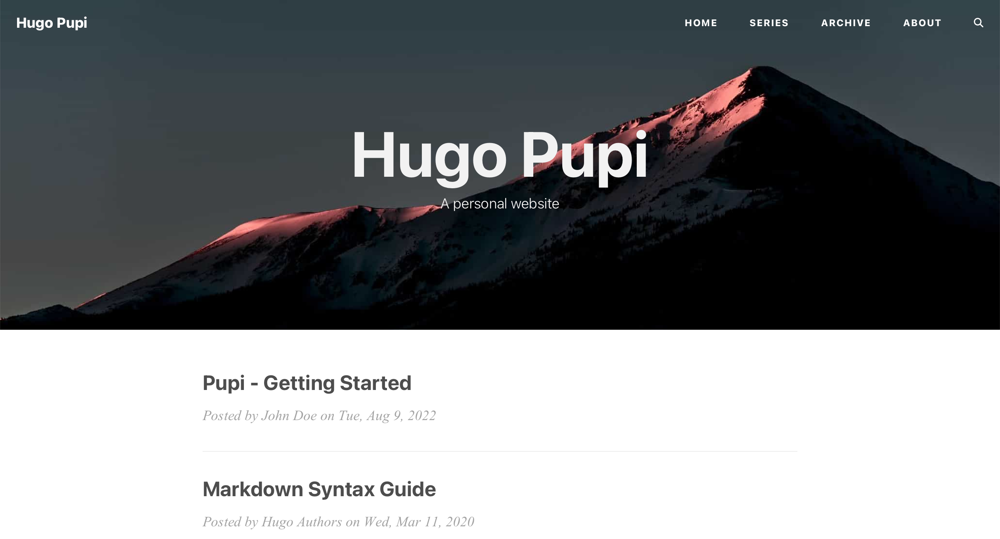

# Hugo Theme Pupi

> Based on [Puppet](https://github.com/roninro/hugo-theme-puppet).
>
> Thanks to [Huxpro](https://github.com/Huxpro/huxpro.github.io) for the awesome theme and to [roninro](https://github.com/roninro) for the Hugo port!

## Screenshot



## Features

- Implemented by Puppet
  + [x] Responsive
  + [x] SEO
  + [x] Table of Contents
  + [x] Image Zoom
  + [x] Syntax Highlighting
  + [x] Search
  + [x] Comments
  + [x] Google Analytics
  + [x] Custom CSS and JS
  + [x] Custom 404 Page
  + [x] Custom Favicon
  + [x] Custom Social Icons
- Added by Pupi
  + [x] Dark Mode
  + [x] Improved Blog Index
  + [x] Simpler Homepage
  + [x] Page layout
  + [x] Page Numbers on the paginator
  + [x] Shortcode template for `figure`
  + [x] KaTeX support
  + [x] Multiple authors support
  + [x] Proof environment
  + [x] ... (lots of adjustments on HTML, CSS, JS)

## Installation

```bash
$ git clone https://github.com/roife/hugo-theme-pupi.git themes/pupi
```

## Configuration

Take a look inside the [exampleSite](exampleSite) folder of this theme. You'll find a file called [config.toml](exampleSite/config.toml). 
To use it, copy the [config.toml](exampleSite/config.toml) in the root directory of your website. Overwrite the existing config file if necessary.

## Content

### Archive Page

add `archive/_index.md` to your `content` folder. This file will be used as the archive page.

### About Page

like the archive page, add `about/_index.md` to your `content` folder.

## Social Icons

The default data of social links is located in [social.toml](assets/data/social.toml)

You can directly set your `id` to get a default social link icon

```toml
[params.social]
mastodon = "@xxxxx"
```
Or You can set more options through a dict:

```toml
[params.social.mastodon]
weight = 56
icon = "fab fa-mastodon"
format = "https://mastodon.social/%v"
id = "johndoe"
url = ""
```

## Change syntax highlighting theme for light and dark mode

```shell
# change light theme
hugo gen chromastyles --style=<light_theme> > <path_to_your_blog>/themes/pupi/layouts/partials/css/syntax-light.css

# change dark theme
hugo gen chromastyles --style=<dark_theme> > <path_to_your_blog>/themes/pupi/layouts/partials/css/syntax-light.css
```

## License

[Apache](LICENSE)
